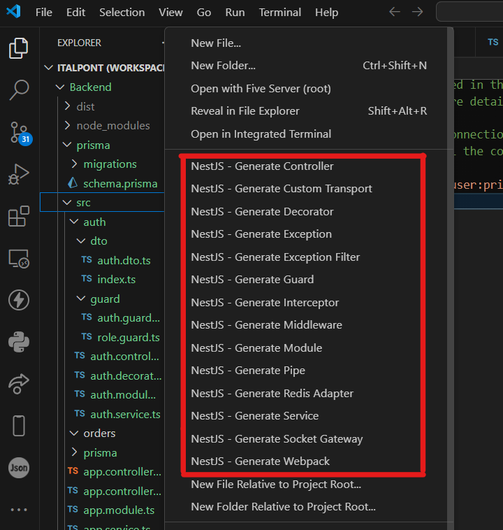
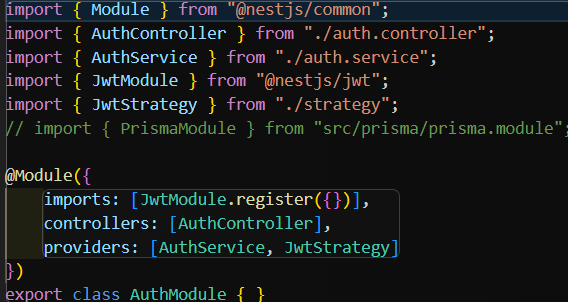
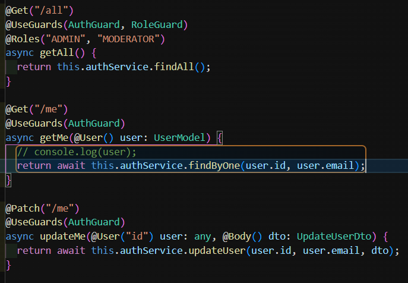
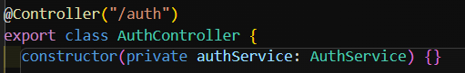
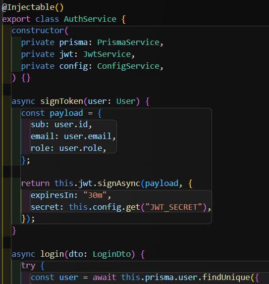
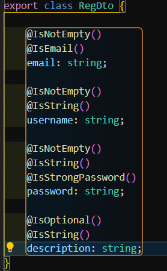
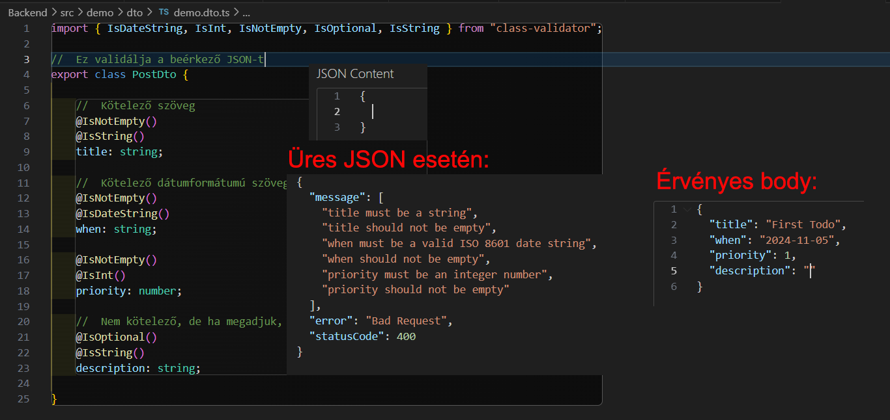
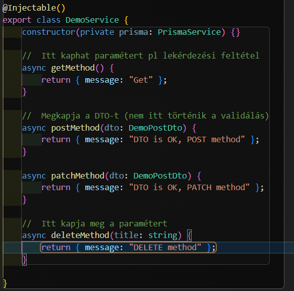
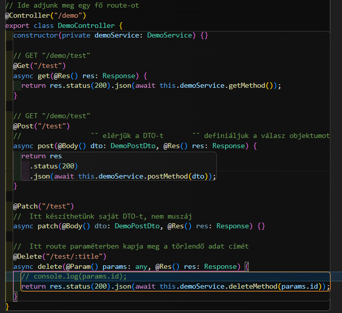

# NestJS Backend tutorial

## Kezdő lépések

1. Telepítsük fel VS Code-hoz a NestJS Files (id: AbhijoyBasak.nestjs-files) kiegészítőt. Ez kibővíti a fejlesztői környezet fájlkezelőjében a mappák jobb egérgombos menüjét:

**Nekünk a következőekre lesz szükségünk**: Module, Controller, Service, esetleg Decorator (bár ehhez még annyira nem értek xd)
Ezen menüpontok használatával generálhatunk komponenst, amiket azonnal beimportálja a modul fájlba (ezért nyitja meg azt is, miután legeneráltad)

2. Kövessük a `Backend` mappában található `readme.md` fájlban található utasításokat.

## Hogyan épül fel egy modul?

###### Itt csak a számotokra fontos komponensek vannak felsorolva

- **Module**:
  - Minden "fő" route (esetünkben adott egy `/auth`) rendelkezik egy modullal
  - Importálja a **kontrollert** és a **service**-t
  - (Tartalmazhat exportálandót, ha más modulból szeretnéd valamelyiket használni, mint a Prisma modul esetén a service)

- **Controller**:
  - Itt vannak definiálva az alroute-ok (mint a `/registration`, `/all`, `/me` (GET és PATCH metódusra is))
  - Átmennek az elő ellenőrzéseken (esetünkben az **AuthGuard** és a **RoleGuard** (+**Roles()** dekorátor) által)
  - Megkapják a **request.body**-t, ami a bejövő adatokat tartalmazza
    - Ha a típusára beállítunk egy **DTO**-t, sikertelen validálás esetén 400-as hibakóddal tér vissza
  - A függvény belső részében hívjuk meg a **service** megfelelő függvényét, esetleg az általa dobott kivételt lehet lekezelni

  - Alább látható, hogy igénybe veszi az `AuthService` komponenst `authService` néven:
  

- **Service**:
  - Itt a végpontokat megvalósító függvények vannak. Ezeket használhatja több végpont, de olyan is akadhat, amit csak service-beli függvény használ.
  - Gyakran használunk benne más **service** komponenst:
  
  *Itt nektek csak a `prisma`-ra lesz szükségetek, esetleg a `config`-ra ha környezeti változót szeretnétek használni.*
- **DTO**:
  - A **Data Transfer Object** felel a beérkező adatok (ha van) validálásáért.
    - Tehát például int elvárású ár mezőnek nem adnatunk string-et.
    - Kötelező vagy opcionális?
    - String-nél megadhatunk min és max hosszúságot, esetleg `@IsDateString()` dátumformátum kötelezettséget.
  - Ha nem teljesíti az elvárásokat, 400 (Bad Request) kóddal válaszol a kliensnek
  
  
    Itt a `description` kivételével mindegyik kötelező, string típusúak (e-mailnél formátum elvárás)

## Hogyan készítsünk modult?

###### A végrehajtott lépéseim láthatóak lesznek majd a `Backend/src`-ben és a `demo` modul lesz megvalósítva

1. Készítsünk mappát a modulunknak a többi mellé.
2. Kezdjük a modul generálással
    1. Jobb egérgomb a `demo` mappán, majd **"Nest JS - Generate Module"**
    2. a fent megjelenő szövegmezőben adjuk meg a modul nevét (esetünkben demo)
        - Ezzel nem csak elkészül a `demo.module.ts` fájl, hanem beimportálja az gyökérmodulba (`app.module.ts`).
3. Ha lesz **service** (nagy eséllyel, legalábbis átláthatóság szempontjából érdemes), már most készítsük el
    1. Jobb egérgomb a `demo` mappán, majd **"Nest JS - Generate Module"**
    2. a fent megjelenő szövegmezőben adjuk meg a modul nevét (esetünkben demo)
        - Ezzel be is importálja a modul fájlba
4. Készítsünk egy kontrollert
    1. Jobb egérgomb a `demo` mappán, majd **"Nest JS - Generate Service"**
    2. a fent megjelenő szövegmezőben adjuk meg a modul nevét (esetünkben demo)
        - Ezzel be is importálja a modul fájlba
    3. Konstruktorban csináljunk adattagot a **service** számára
        - Esetünkben `demoService` `DemoService` típussal
    4. A Controller dekorátorban írjuk be route-unk nevét (esetünkben "/demo")
        - Ha ezt kihagyjuk nem "/demo/:path" (ahol a `:path` az alroute) használatával érhetjük el az alroute-ot, hanem "/:path"
        - Ezzel elkerüljük a későbbi esetleges útvonal ütközéseket
    5. Ha szeretnénk validálni, csináljunk egy `dto` mappát, majd abban az `auth.dto.ts` fájlt készítsük el, benne egy osztályt és a szükséges [validáló dekorátorokkal](https://github.com/typestack/class-validator?tab=readme-ov-file#validation-decorators).
    
    Csináljunk `index.ts` fájlt, amiben kiexportálunk mindent a dto fájlból a következő sorral:
    `export * from "./demo.dto";` - ahol a "demo.dto" az általunk készített dto fájl
5. Valósítsuk meg a **service** fájlban a függvényeket

6. Készítsünk végpontokat
    
        - Itt készítettem GET, POST, PATCH és DELETE végpontokat
        - Mint látható, ugyanazon végpont létezhet különféle HTTP kérésmetódusokra
        - itt teljesen mindegy, milyen függvényneveket adunk meg